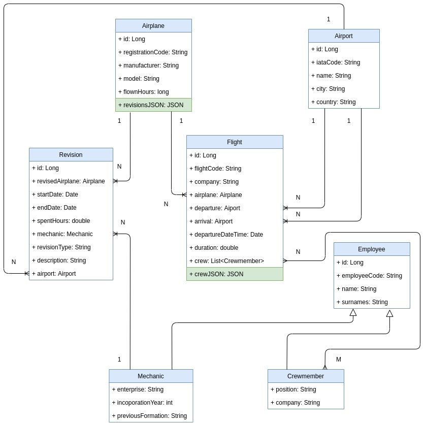

# Relational Persistence

This is a Java 8 project that implements the following [scenario](doc/scenario.md). All the information is stored in a [MySQL](https://www.mysql.com/) database using SpringData to manage it.

## Database diagram



Notes:

* ```Mechanic``` and ```Crewmember``` extends from ```Employee```, because both have some attributes in common. **Mapped Superclass** approach has been applied.
* **N:M relationship** between ```Crewmember``` and ```Flight``` has been splitted in two 1:N relationships, using an intermediate table named ```fligth_crewmember``` that stores the relation having as columms:
  * *flight_id*: ID of the flight.
  * *employee_id*: ID of the mechanic.

## Deployment

Before deploy the application, is needed to has an available MySQL database, the most easy way is with [docker](https://www.docker.com/) executing the following command:

```
$ docker run --rm -e MYSQL_ROOT_HOST=% -e MYSQL_ROOT_PASSWORD=password -e MYSQL_DATABASE=test -p 3306:3306 -d --name relational-persistence mysql/mysql-server:8.0.23
```

Or you can just execute the provided [start-mysql-container.sh](start-mysql-container.sh) script with the command:

```
$ ./start-mysql-container.sh
```

Once MySQL instance is up and running, to show the database stored information and the result of the requested queries execute:

```
$ mvn spring-boot:run
```

Notes:

* *spring.jpa.hibernate.ddl-auto* property has as value ```create``` so every time that the application will be executed, the information will be stored in the information and it will be available once the execution will be finished. 
* **DTOs (Data Transfer Objects)** has been used to retrieve the result of the requested queries.
* The starting point in order to understand the application is [RelationalPersistenceController](src/main/java/com/cloudapps/relational_persistence/controller/RelationalPersistenceController.java) class. It executes the main three parts of the application:
  * Populate the database.
  * Print database stored information.
  * Execute requested queries and print their result.

## Author

[David Rojo (@david-rojo)](https://github.com/david-rojo)
